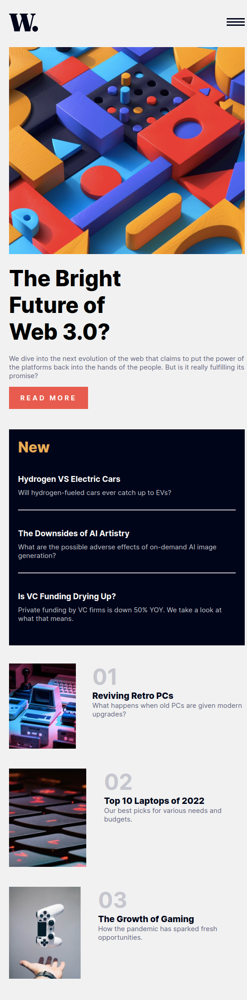
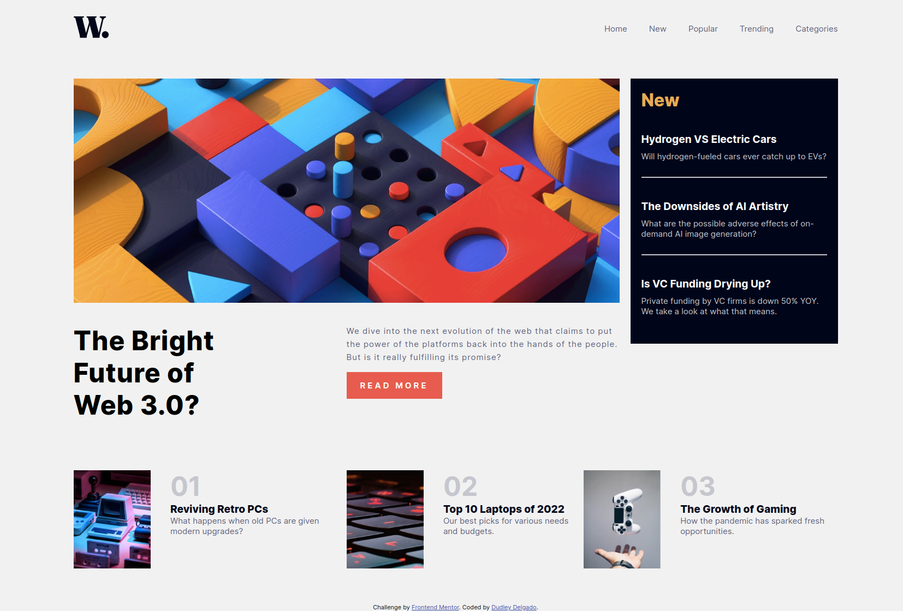

# Frontend Mentor - News homepage solution

This is a solution to the [News homepage challenge on Frontend Mentor](https://www.frontendmentor.io/challenges/news-homepage-H6SWTa1MFl). Frontend Mentor challenges help you improve your coding skills by building realistic projects. 

## Table of contents

  - [The challenge](#the-challenge)
  - [Screenshot](#screenshot)
  - [Links](#links)
  - [Built with](#built-with)
  - [Author](#author)
  - [Acknowledgments](#acknowledgments)

### The challenge

Users should be able to:

- View the optimal layout for the interface depending on their device's screen size
- See hover and focus states for all interactive elements on the page

### Screenshot

### Links

- Solution URL: [Add solution URL here](https://www.frontendmentor.io/solutions/news-homepage-KrttMDhgUF)
- Live Site URL: [Add live site URL here](https://dudleydelgado.github.io/news-homepage-challenge/)

### Built with

- Semantic HTML5 markup
- CSS custom properties
- Flexbox
- CSS Grid
- Mobile-first workflow

## Author

- Website - [Dudley Delgado](https://dudleydelgado.github.io/portfolio/)
- Frontend Mentor - [@yourusername](https://www.frontendmentor.io/profile/dudleydelgado)
- Instagram - [@dudley.code](https://www.instagram.com/dudley.code/)